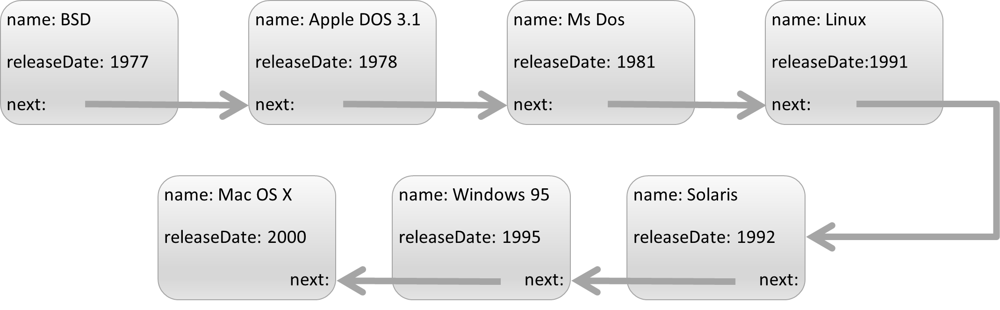
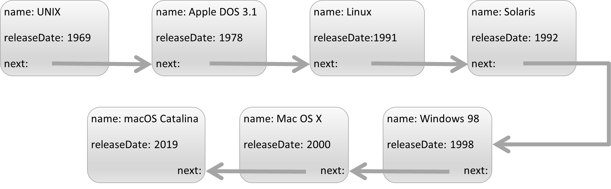

# 3. Programmieraufgabe: Einfach verkettete Liste

## Allgemeine Hinweise

Bitte lesen Sie die folgenden Hinweise genau durch!

* Sie haben max. drei Versuche, eine korrekte Lösung einzureichen.
* Bitte verwenden Sie die `solution.py` als Basis. Beachten Sie dabei:
    - Behalten Sie die *Schnittstellen* der zu implementierenden Funktionen genau bei.
    - Fügen Sie *keinen* unnötigen *Code außerhalb der Funktionen* ein, d.h. *vermeiden* Sie auch die Verwendung von *globalen Variablen*.
    - Verwenden Sie *keine `input`- oder `import`-Anweisungen*.
* Testen Sie Ihren Code selbst mit den von uns zur Verfügung gestellten Tests, bevor Sie ihn einreichen! Sie können auch weitere Testfälle hinzufügen, die Sie sich selbst ausdenken! Wir testen Ihren Code ebenfalls noch mit zusätzlichen Eingaben.
* Die Abgabe erfolgt individuell. Kopieren von Code von anderen Studierenden ist verboten und wird als Betrugsversuch interpretiert.
* Verwenden Sie *Python 3* (nicht 2).

&nbsp;

**Für diese Aufgabe wird ingesamt 1 Punkt vergeben.**

&nbsp;

## Aufgabenstellung

Als angehende Informatiker müssen Sie in Ihrem späteren Beruf nicht nur eigenen Code entwickeln, sondern sehr oft eine bestehende Codebase verstehen und debuggen können. In dieser Aufgabe erhalten Sie fremden Code, der einige Fehler enthält, welche Sie beheben sollen.

Stellen Sie sich folgendes Szenario vor: 
Ihr Kollege möchte die Chronolgie der Betriebssysteme mit Hilfe von einfach verketteten Listen in der objektorientierten Implementierung darstellen. Die ersten Betriebssysteme sind in den 1950er erschienen. Im Jahr 1969 wurde Unics veröffentlicht, das das bekannte Warenzeichen Unix geprägt hat. Dieses Betriebssystem hat die berühmten Nachfolger inspiriert, wie z.B. Linux und Mac OS.  

Im Folgenden werden die Klassen und die gewünschte Funktionalität der Methoden im fehlerfreien Fall erläutert. Alle Beispiele beziehen sich auf die Timeline, welche in den Abbildungen am Ende des Dokuments dargestellt ist.

Die Datei `solution.py` stellt zwei Klassen, `OperatingSystem` und `OSTimeline`, zur Verfügung. 

Die Klasse `OperatingSystem` hat drei Datenelemente: `name`, `releaseDate` und `next` (das letzte Datenelement wird standardmäßig auf `None` gesetzt). Die Klasse `OSTimeline` hat nur ein Datenelement, `head`, und drei Methoden `traverse`, `insert` und `remove`. 

`OSTimeline` ist eine chronologisch sortierte Sequenz von Betriebssystemen, die durch eine einfach verkettete Liste repräsentiert wird. 

* Die Methode `traverse` durchläuft (traversiert) die Timeline in chronologischer Reihenfolge und gibt die Elemente als Liste zurück. Diese Methode enthält keinerlei Fehler. 
* Die Methode `insert` fügt ein neues Betriebssystem in die Timeline ein und behält dabei die Sortierung bei. Sie erhält als Eingabe `name` und `releaseDate`. Wenn beispielsweise ein Betriebssystem mit den Parametern `name="Linux 0.1"` und `releaseDate=1991` in die folgende Beispiel-Timeline eingefügt wird, wird es nach „Unics“ und vor „Windows 95“ einsortiert. Ist ein Betriebssystem mit dem übergebenen Erscheinungsjahr in der Timeline bereits vorhanden, gibt die Methode `insert` als Ausgabe den String `"invalid year"` zurück. Ansonsten lautet die Ausgabe `"inserted"`. 
* Die Methode `remove` erhält als Eingabe ein Erscheinungsjahr `yearToRemove` und entfernt das entsprechende Betriebssystem aus der Reihe. Gibt es mehrere Betriebssysteme mit diesem Erscheinungsjahr, wird nur der erste Treffer entfernt. Existiert ein Betriebssystem mit dem übergebenen Erscheinungsjahr nicht in der Timeline, gibt die Methode den String `"invalid year"` zurück. Ansonsten lautet die Rückgabe `"removed"`.

Der aktuelle Code enthält jedoch 3 Fehler (logische wie syntaktische). 
Ihre Aufgabe besteht darin, diese Fehler zu finden und direkt im Code zu beheben, sodass die `StudentTestSuite` fehlerfrei durchläuft und die Eingabe einer beliebigen verketteten Liste am Schluss die korrekte chronologische Reihenfolge besitzt.

Für das Testen des Codes sind mehrere Instanzen der Klasse `OperatingSystem` und eine Instanz der Klasse `OSTimeline` bereits im Code erzeugt worden (siehe erste Abbildung). Dieser verketteten Liste werden im Folgenden Elemente hinzugefügt oder entfernt. Die so am Schluss entstandene Timeline sehen Sie in der zweiten Abbildung. Anhand dieser Abfolge und mit Hilfe der Methode `traverse` können Sie beginnen den Code zu debuggen. Sie können diese Abfolge aber auch verändern oder erweitern. 

&nbsp;

Die Abbildung oben zeigt die zu Beginn erzeugte einfach verkettete Liste, die Abbildung unten dann die Liste nach Ablauf der Befehlsabfolge. 

&nbsp;

**Wichtig:** Behalten Sie die Schnittstellen aller Methoden bei. In der Methode `traverse` ist kein Fehler versteckt. Verändern Sie diese Methode auf keinen Fall, da mit ihrer Hilfe die Richtigkeit der Implementierung getestet wird.

&nbsp;

## Beispiele

(basierend auf Beispiel-Timeline, s.o.)

| Mustereingabe | Erwarteter Rückgabewert der jeweiligen Methode |
| --- | --- |
| `timeline.insert("Red Hat Linux 6.2E", 2000)` | `False` |
| `timeline.remove(1977)` | `True` |
| `timeline.remove(1994)` | `False` |
| `timeline.insert("Unix", 1969)` | `True` |
| `timeline.remove(1981)` | `True` |
| `timeline.insert("Mac OS X 10.4", 2005)` | `True` |
| `timeline.remove(2005)` | `True` |
| `timeline.insert("macOS Catalina", 2019)` | `True` |
| `timeline.remove(1995)` | `True` |
| `timeline.insert("Windows 98", 1998)` | `True` |