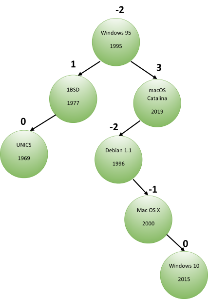

# 9. Programmieraufgabe: Balancefaktoren in einem Suchbaum

## Allgemeine Hinweise

Bitte lesen Sie die folgenden Hinweise genau durch!

* Sie haben max. drei Versuche, eine korrekte Lösung einzureichen.
* Bitte verwenden Sie die `solution.py` als Basis. Beachten Sie dabei:
    - Behalten Sie die *Schnittstellen* der zu implementierenden Funktionen genau bei.
    - Fügen Sie *keinen* unnötigen *Code außerhalb der Funktionen* ein, d.h. *vermeiden* Sie auch die Verwendung von *globalen Variablen*.
    - Verwenden Sie *keine `input`- oder `import`-Anweisungen*.
* Testen Sie Ihren Code selbst mit den von uns zur Verfügung gestellten Tests, bevor Sie ihn einreichen! Sie können auch weitere Testfälle hinzufügen, die Sie sich selbst ausdenken! Wir testen Ihren Code ebenfalls noch mit zusätzlichen Eingaben.
* Die Abgabe erfolgt individuell. Kopieren von Code von anderen Studierenden ist verboten und wird als Betrugsversuch interpretiert.
* Verwenden Sie *Python 3* (nicht 2).

&nbsp;

**Für diese Aufgabe wird ingesamt 1 Punkt vergeben.**

&nbsp;

## Aufgabenstellung

In dieser Aufgabe sollen Sie alle Balancefaktoren eines gegebenen Suchbaums bestimmen. 

Die Klasse `OperatingSystem` hat sechs Eigenschaften: `name`, `releaseDate`, `left` und `right`, `height` und `balance`. 
`left` und `right` verweisen auf das linke bzw. rechte Kind. Wenn eine Instanz von `OperatingSystem` erzeugt wird, werden `left` und `right` standardmäßig auf `None` gesetzt. `height` beschreibt die Höhe des jeweiligen Knotens, wobei Blätter die Höhe 0 haben, und `balance` beschreibt den Balancefaktor.

Die Klasse `OperatingSystem` hat drei Methoden:
* den Konstruktor `__init__(self, name=None, date=None)`,
* `addOS(self, os)`, welche die Knoten naiv einem Suchbaum hinzufügt
* und `traverse()`, die einen Baum nach dem `preorder` Prinzip traversiert. 

Der aktuell vorhandene Code implementiert den Suchbaum, der in der obigen Abbildung dargestellt wird, allerdings ohne die dazugehörigen Balancefaktoren. 

Implementieren Sie eine weitere Klassenmethode `determineBalanceFactors(self, balanceFactors=None)`, die alle Balancefaktoren eines Suchbaums, wie in der Vorlesung definiert, bestimmt.
Der Suchbaum ist dabei ein Binärbaum und unbalanciert. Der Fall eines leeren Baumes **muss nicht** betrachtet werden. 

**Wichtig:** Ändern Sie keine der Methoden außer `determineBalanceFactors(self, balanceFactors=None)`.

&nbsp;

## Beispiele

(basierend auf Beispiel-Suchbaum, s.o.)

| Methodenaufruf | Erwarteter Rückgabewert der Methode `determineBalanceFactors` |
| --- | --- |
| `self.os1.determineBalanceFactors()` | `[('Unics',0),('1BSD',1),('Windows 10',0),('Mac OS X',-1),('Debian 1.1',-2),('macOS Catalina',3),('Windows 95',-2)]` |